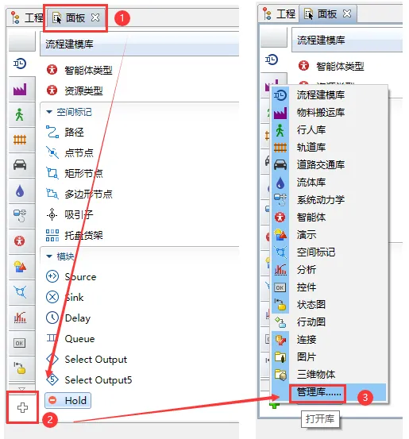
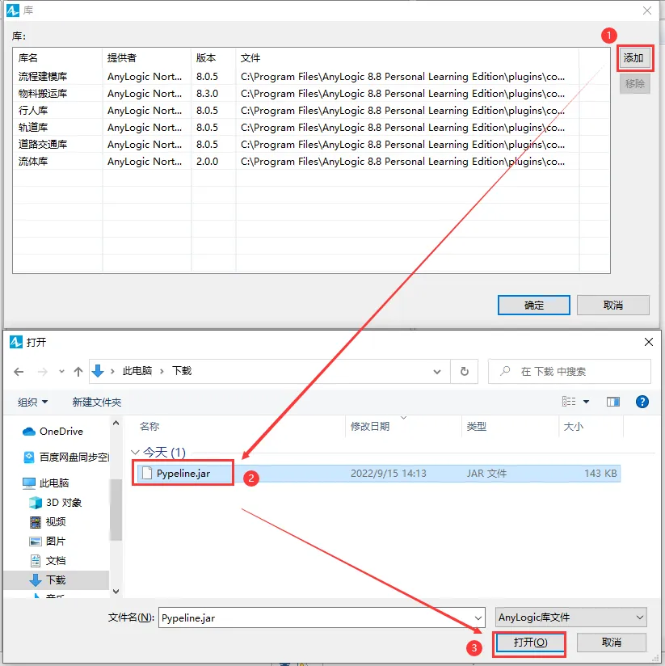
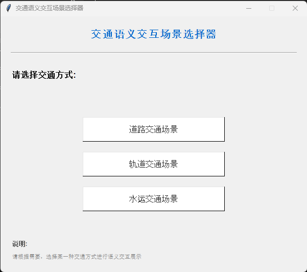
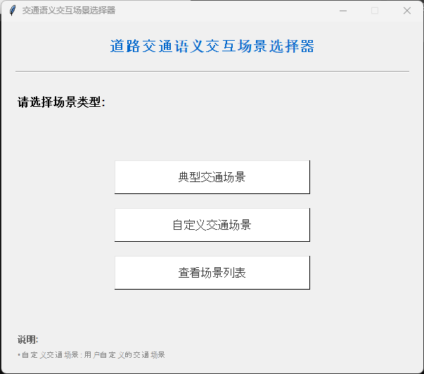
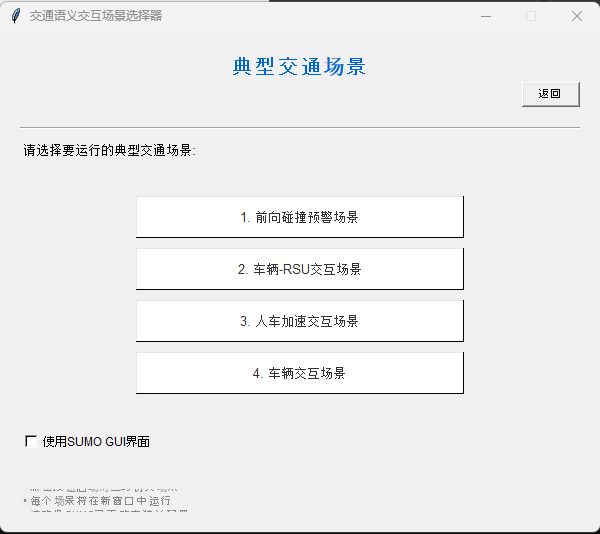
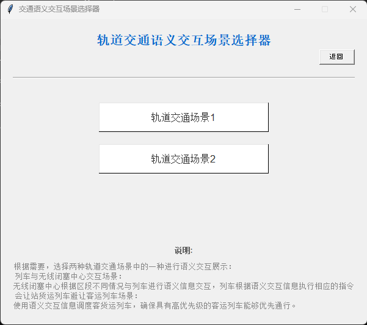

# EN-AutonomousTransportationSystem-TrafficSemanticRepresentationLanguage-TSRL-SimulationPlatform

## Project Introduction

# CN-自主式交通系统-交通语义表示语言-TSRL-仿真平台

## 项目简介

自主交通系统语义交互仿真平台(Autonomous Transportation Semantic Interaction Simulation Platform, ATSISP)作为自主式交通系统的验证平台的之一，拥有对于交通语义表示语言(TSRL)的系统性验证能力。本平台能够实现的功能包括：

* 基于交通语义表示语言(TSRL)的显性知识表示。
* 交通主体间的语义通信交互能力。
* 针对TSRL的“词法分析-语法分析-介绍执行”集成引擎，以模拟和分析交通场景下的复杂交互行为。

本项目主要使用Python编写，依赖SUMO (Simulation of Urban MObility)进行底层交通仿真。

## 核心组件与功能

1. **交通仿真核心 (`simModel/`)**: 基于 SUMO 的仿真底座，负责道路场景中的仿真环境构建、场景加载、回放与可视化，包含 `fixedScene`、`egoTracking` 和 `common` 等子模块。
2. **交通管理与规划 (`trafficManager/`)**: 负责车辆行为更新、预测、决策与轨迹规划，目录下按 `common`、`predictor`、`decision_maker`、`planner` 分层组织，支撑多车规划和 TSRL 驱动决策。
3. **语义交互层 (`TSRL_interaction/`)**: 实现交通主体之间的语义通信机制，封装车辆侧通信逻辑、通信类别定义及消息交互流程，用于支撑车车、车路等交互场景。
4. **TSRL 解析与推理引擎 (`TSRL_parsing_and_inference/`, `TSRL_txt/`)**:

   * `TSRL_parsing_and_inference/` 提供词法分析、语法分析、解释执行和推理引擎实现，是 TSRL 规则执行的核心代码目录。
   * `TSRL_txt/` 存放规则文本、推理输入输出和展示文本，用于驱动和记录语义推理过程。
5. **多交通方式场景资源 (`networkFiles/`, `Railway Transportation System/`, `Ship Transportation System/`)**:

   * `networkFiles/` 存放道路交通场景的路网、路线、配置及辅助脚本，覆盖前向碰撞预警、车路交互、匝道汇入、协同驾驶等场景。
   * `Railway Transportation System/` 和 `Ship Transportation System/` 分别存放轨道交通、水运交通相关模型、输入脚本和示例工程。
6. **场景选择与启动入口 (`Start.bat`, `tkinter_scenario_selector.py`, `Transportation_Semantic_Selector.py`, `Classic_Scenarios_Selection.py`)**:

   * 提供图形化场景选择与分类入口，用于启动道路、轨道、水运等不同交通方式的语义交互仿真。
   * 同时支持典型场景选择和自定义场景构建流程。
7. **辅助数据与支撑模块 (`message_history/`, `evaluation/`, `logger/`, `utils/`, `assets_new/`, `Database/`, `DEBUG_TSRL/`)**:

   * 用于保存通信历史、推理展示结果、评估分析、日志、通用工具、界面图片资源以及调试和数据库相关文件。

## 项目结构

* `simModel/`: 基于 SUMO 的交通仿真核心代码，包含固定场景、主车跟踪和公共组件
* `trafficManager/`: 交通管理、行为决策、预测与轨迹规划模块
* `TSRL_interaction/`: 交通语义交互通信模块
* `TSRL_parsing_and_inference/`: TSRL/TSIL 的词法分析、语法分析、解释执行与推理引擎实现
* `TSRL_txt/`: 规则文本、推理输入输出和展示文本
* `networkFiles/`: 道路交通仿真场景文件，包括路网、路线、SUMO 配置及辅助脚本
* `Railway Transportation System/`: 轨道交通场景、AnyLogic 工程及相关推理脚本
* `Ship Transportation System/`: 水运交通场景及相关推理脚本
* `message_history/`: 仿真过程中的消息历史与展示文本
* `evaluation/`: 指标计算、碰撞统计与评估报告相关代码
* `logger/`: 日志封装与日志说明
* `utils/`: 几何计算、轨迹处理、路网处理等通用工具
* `assets_new/`: README 和界面说明中使用的图片资源
* `Database/`, `DEBUG_TSRL/`: 数据存储与调试分析相关目录
* `Group Standard 《Autonomous transportation system - traffic semantic representation language》/`: TSRL 英文标准文档
* `团体标准《自主式交通系统 交通语义表示语言》/`: TSRL 中文标准文档
* `Start.bat`: 项目启动入口
* `tkinter_scenario_selector.py`: 总场景选择界面
* `Transportation_Semantic_Selector.py`: 交通方式选择界面
* `Classic_Scenarios_Selection.py`: 典型道路场景选择界面

## 开发与运行

### 环境要求

* 3.9.0 <= Python <= 3.11.0
* SUMO >= 1.15.0
* 依赖库: `dearpygui`, `matplotlib`, `numpy`, `pandas`, `pynput`, `PyYAML`, `rich`, `sumolib`, `traci` (详见 `requirements.txt`)

### 快速开始

1. 环境配置

   1. Python

      **推荐版本**: 3.9.0 <= Python <= 3.11.0
   2. SUMO

      1. 安装SUMO（Windows）

         **推荐版本**: SUMO >= 1.15.0 (Recommended version: 1.15.0)

         *该版本的SUMO已包含在项目文件夹中，无需额外安装(`sumo-1.15.0`)。*
      2. 配置环境变量

         1. 将SUMO的 `bin/` 目录添加到**系统变量and环境变量**的 `PATH` 中。
         2. 新建并设置环境变量 `SUMO_HOME` 为SUMO安装目录 (e.g., `export SUMO_HOME=./sumo-1.15.0/`)
         3. 验证安装
            1. 打开命令行终端
            2. 输入 `sumo --version`
            3. 确认输出显示SUMO版本为1.15.0
            4. 输入 `sumo-gui`
            5. 确认SUMO GUI窗口打开，显示空的交通场景
   3. Anylogic

      1. 安装Anylogic（Windows）

         https://www.anylogic.com/downloads/

         **推荐版本**: 8.9.6 Personal Learning Edition（需手动安装）
      2. 配置Pypeline：在Anylogic中使用Python

         1. https://github.com/the-anylogic-company/AnyLogic-Pypeline/releases 下载Pypeline.jar v1.9.6，并解压到本地

            *所需的Pypeline.jar已包含在项目文件夹中，无需额外安装(`.venv\Pypeline.jar`)。*
         2. 打开已经安装好的Anylogic，找到”**面板（Palette）**“>>左下角的“+”>>**管理库……**

            
         3. 点击“**添加**”，找到下载好的Pypeline.jar文件，添加到Anylogic中
            
         4. 点击“**确定**”，Pypeline库就会被添加到Anylogic中
2. 安装所需依赖:

   `cd ATSISP pip install -r requirements.txt`

   `pip install -r requirements.txt`

### 操作说明

1. **交通语义交互场景选择界面**: 双击批处理文件 `Start.bat`，即可打开交通语义交互场景选择界面。

   
2. **选择所需的交通方式**: 点击场景选择器中的交通方式按钮，即可启动对应的交通语义交互场景。

   1. 道路交通场景

      点击**道路交通场景**按钮，即可启动道路交通场景的仿真。

      在新弹出的窗口中，用户可以选择不同的场景类型，如**典型交通场景**、**自定义交通场景**等。

      

      * 典型交通场景

        点击**典型交通场景**按钮，即可启动典型交通场景的仿真。

        在新弹出的窗口中，用户可以选择不同的典型交通场景，如**前向碰撞预警场景**、**车辆-RSU交互场景**等。

        
   2. 轨道交通场景

      点击**轨道交通场景**按钮，即可启动轨道交通场景的仿真。

      在新弹出的窗口中，用户可以选择不同的轨道交通场景，具体的场景介绍可以在弹窗文字中进行查看。

      
   3. 水运交通场景

      点击**水运交通场景**按钮，即可启动水运交通场景的仿真。

### 自定义场景创建

通过场景选择器的"自定义交通场景"选项，用户可以创建新的仿真场景：

1. 创建路网文件（使用Netedit工具）
2. 创建路由文件
3. 添加其他必要的配置文件

## 开发约定与实践

* **代码风格**: 遵循Python通用编码规范，部分文件包含中文注释以解释功能和逻辑。核心模块如 `trafficManager` 和 `TSRL_interaction` 有较详细的英文文档字符串 (docstring) 描述类和方法的功能。
* **模块化**: 项目结构清晰，将仿真、规划、交互、推理等功能分离到不同模块和目录下，便于维护和扩展。
* **通信机制**: 车辆和RSU通过 `CommunicationManager` 进行消息传递，消息内容遵循FIPA ACL标准，增强了交互的规范性和可扩展性。消息历史记录被保存到 `message_history/` 目录下，便于调试和分析。
