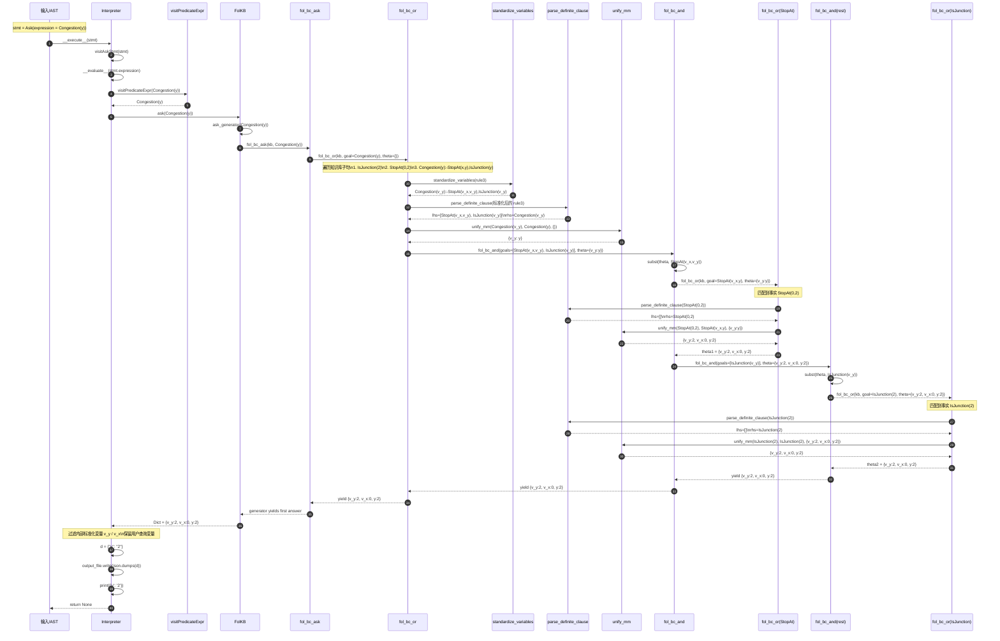

# `ASK Congestion(y);` 调用链顺序图

下面的顺序图描述了在知识库已包含以下事实与规则时：

```txt
IsJunction(2);
StopAt(0,2);
Congestion(y):-StopAt(x,y),IsJunction(y);
ASK Congestion(y);
```

执行 `ASK Congestion(y);` 时，`Interpreter.visitAskStmt` 及其下游方法之间的主要数据传递过程。



## 结果说明

- 推理器内部拿到的第一个置换结果是：`{v_y:2, v_x:0, y:2}`
- `visitAskStmt` 过滤内部变量后写出的结果是：`{"y": "2"}`
- `visitAskStmt` 方法自身没有显式 `return`，因此返回值为 `None`
