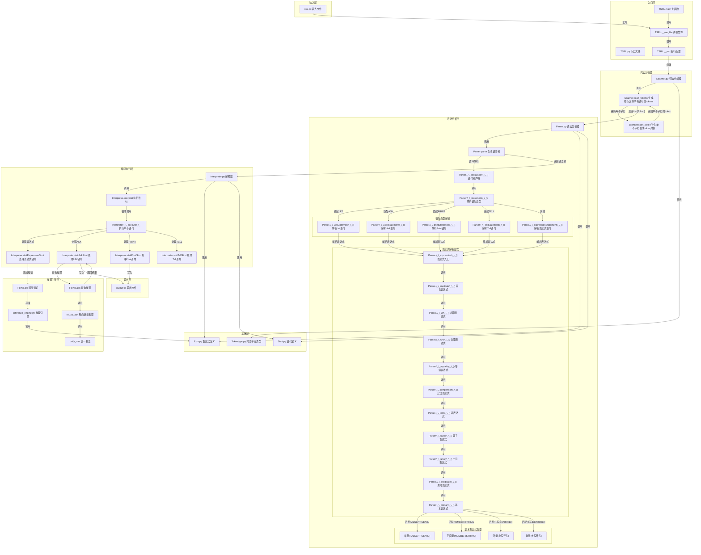

# TSRL 系统数据流导向图

## 数据流导向图

## 关键函数和数据流向说明

### 1. 输入流程
- **TSRL.main()**：接收输入文件路径和输出文件路径，是系统的入口点
- **TSRL.__run_file()**：读取输入文件内容，将其转换为字符串
- **TSRL.__run()**：开始处理流程，创建词法分析器

### 2. 词法分析
- **Scanner.scan_tokens()**：将输入文本转换为词法单元（tokens）
- 处理关键字、运算符、常量等，生成token列表

### 3. 语法分析
- **Parser.parse()**：将tokens转换为抽象语法树（AST）
- 支持Let、Ask、Print、Tell等语句类型
- 构建表达式和语句的层次结构

### 4. 解释执行
- **Interpreter.interpret()**：遍历执行语法树中的所有语句
- **Interpreter.__execute__()**：执行单个语句，根据语句类型调用相应的访问方法
- **Interpreter.visitExpressionStmt()**：处理表达式语句，将表达式添加到知识库
- **Interpreter.visitAskStmt()**：处理ASK语句，执行查询并返回结果

### 5. 推理引擎
- **FolKB.tell()**：将表达式添加到知识库中
- **FolKB.ask()**：执行推理查询，返回满足条件的置换
- **fol_bc_ask()**：使用反向链接算法进行推理，查找满足查询的解

### 6. 输出流程
- 推理结果写入指定的输出文件
- 支持JSON格式输出置换结果
- 对于ASK语句，将推理结果写入output.txt

### 数据流向
- **输入文件 → 词法分析 → 语法分析 → 解释执行 → 推理 → 输出文件**
- 各模块通过函数调用和数据传递形成完整的处理链
- 基础模块（Expr、Stmt、Tokentype）被其他模块广泛使用

### 核心数据结构
- **Token**：词法单元，包含类型、值、位置等信息
- **Expr**：表达式基类，包括Predicate、Implication、Binary等子类
- **Stmt**：语句基类，包括Expression、Ask、Print、Tell等子类
- **FolKB**：一阶逻辑知识库，存储知识和执行推理

## 查看方式

1. **使用支持 Mermaid 的编辑器**：如 VS Code（安装 Mermaid 插件）、GitHub、GitLab 等
2. **使用在线 Mermaid 编辑器**：访问 https://mermaid.live/，复制上述 Mermaid 代码进行渲染
3. **使用 Markdown 查看器**：许多 Markdown 查看器都支持 Mermaid 图表渲染

## 注意事项

- 图表展示了 TSRL 系统的完整数据流路径
- 各模块之间的依赖关系和数据流向清晰可见
- 关键函数和处理步骤已在图表中标注
- 此图表可帮助理解 TSRL 系统的工作原理和处理流程