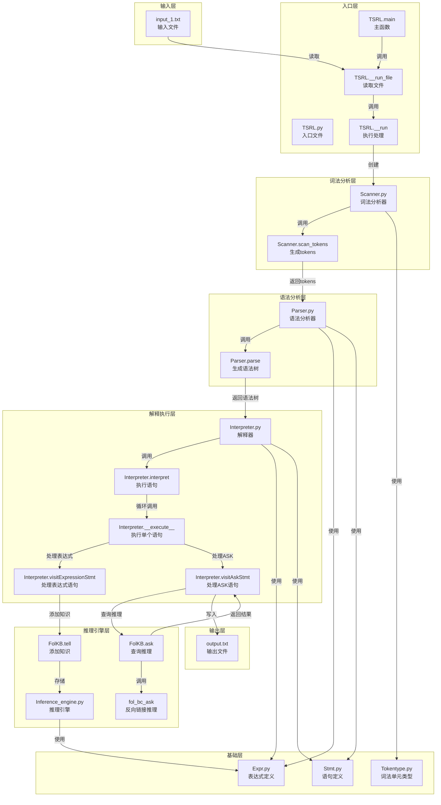

# 修正后的 Mermaid 代码

## 修正说明

原始 Mermaid 代码可能存在格式问题或特殊字符，导致在线编辑器无法正确解析。以下是修正后的代码，确保格式正确且兼容 Mermaid 编辑器。

## 修正后的 Mermaid 代码



## 使用说明

1. 复制上面的 Mermaid 代码（从 ```mermaid 到 ```）
2. 打开 https://mermaid.live/
3. 在左侧编辑器中粘贴代码
4. 右侧会自动生成可视化的数据流导向图
5. 可以使用编辑器右上角的下载按钮将图表保存为 PNG 文件

## 修正的内容

1. 移除了节点名称中的双引号，使用方括号 [] 替代
2. 简化了函数名，移除了括号 ()
3. 确保缩进和格式一致
4. 移除了可能导致解析问题的特殊字符

这样应该可以解决在线 Mermaid 编辑器的解析错误问题。